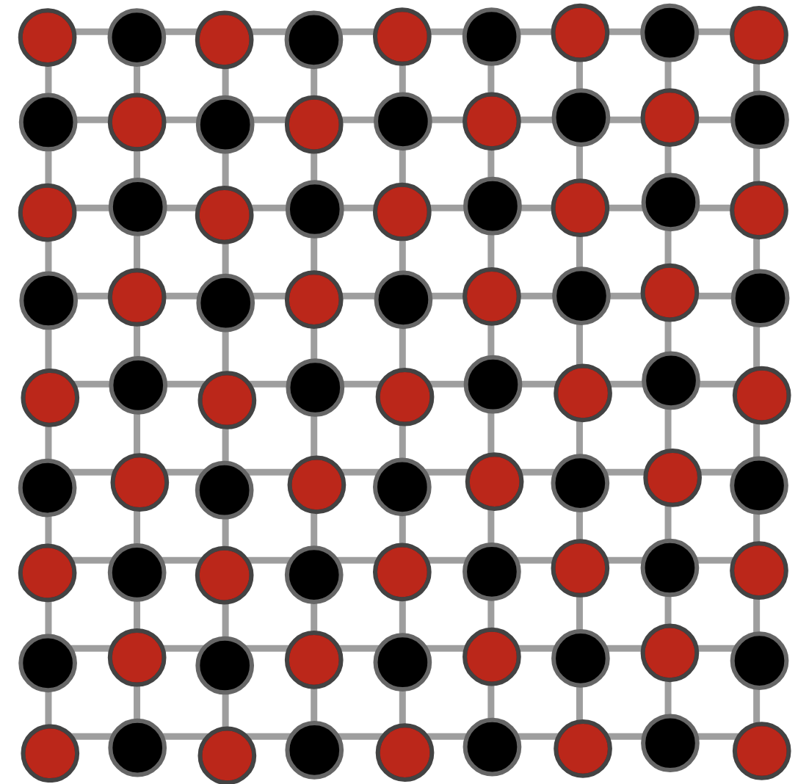
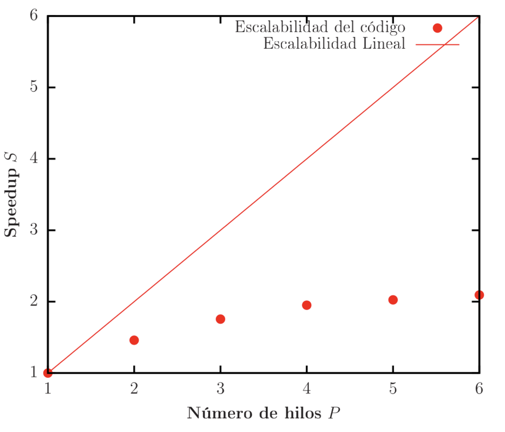
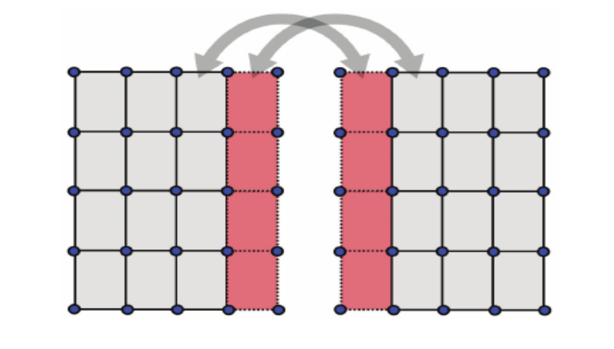

# Métodos de paralelisación en memoria compartida y distribuida
## Paralelización del Método de Gauss-Seidel en memoria compartida: Red-Black

Para paralelizar el método iterativo de Gauss-Seidel, se implementó la técnica *Red-Black*, una estrategia común en la solución de ecuaciones diferenciales parciales sobre mallas discretas, ideal para la ecuación de Laplace utilizada en este proyecto.

Esta técnica divide los puntos de la grilla en dos subconjuntos intercalados —similar a un tablero de ajedrez— donde cada punto "rojo" solo tiene vecinos "negros" y viceversa. Esto permite actualizar simultáneamente todos los puntos de un mismo color sin dependencias internas.

Cada punto $(i,j)$ se asigna un color según la condición:  
- Rojo si $(i + j) \bmod 2 = 0$
- Negro si $(i + j) \bmod 2 = 1$

El algoritmo se ejecuta en dos pasos por iteración: primero se actualizan todos los puntos rojos usando los valores actuales de sus vecinos negros; luego se actualizan los puntos negros usando los valores recién calculados de los puntos rojos. Así, cada subconjunto se puede procesar en paralelo.

La paralelización se logra asignando a múltiples hilos la actualización de los puntos de un mismo color, lo que en entornos multicore o GPU mejora considerablemente el rendimiento. Para maximizar la eficiencia, se deben cuidar aspectos como el balance de carga, el acceso concurrente a memoria y la sincronización entre fases.

  
  

## Posible estrategia de paralelización en memoria distribuida

Para poder implementar el paradigma de paralelización en memoria distribuida se plantea hacer uso de las celdas fantasma o también llamadas "Ghost cells” en inglés. Cuando se utilizan métodos numéricos para resolver un sistema en donde se va iterar sobre una grilla, estas ghost cells son copias locales de los datos de frontera entre valores vecinos. Dada una grilla de un tamaño NxN, esta se puede subdividir en grillas más pequeñas para poder asignar cada una de ellas a un proceso. No obstante, por la interdependencia de los datos, para actualizar sus valores en los bordes es necesario conocer los valores de los puntos de las grillas adyacentes, que pueden estar almacenados en otro proceso. Es aquí donde se implementan las celdas fantasmas, que son copias locales de estos valores para que cada proceso pueda seguir iterando y actualizando sus valores. En vez de pedir un valor cada vez, se hace una sincronización de frontera (intercambio de ghost cells) cada cierto paso.

Para nuestro caso, lo más sencillo sería dividir la grilla en bandas horizontales (fila a fila), donde cada proceso manejaría un arreglo de filas locales más 2 filas fantasma, una arriba y otra abajo de forma que así se armaría su grilla loca. Si los valores de la frontera están en otro proceso, estos valores se copian en las celdas fantasma por medio de comunicación de MPI como MPI_Sendrecv. Después de cada iteración, cada proceso envía su frontera superior al proceso vecino de arriba y recibe su frontera inferior. Para detener los procesos de forma global y lograr la convergencia, cada proceso calcula su delta local y luego se usa una reducción como por ejemplo MPI_Allreduce para obtener el delta máximo global y verificar convergencia.

  

# Métodos numéricos utilizados en la elaboración del proyecto:

En la resolución del problema se hizo uso de métodos iterativos, junto con el modelo de diferencias finitas para aproximar la ecuación de Laplace sobre una malla discreta. Esta aproximación permite obtener una solución numérica al problema de potencial eléctrico en un dominio bidimensional, aplicando condiciones de frontera fijas y cargando valores específicos en ciertas regiones.

## Método de relajación de Jacobi:

El método de relajación de Jacobi es un proceso iterativo utilizado para resolver sistemas de ecuaciones lineales, especialmente los que provienen de la discretización de ecuaciones diferenciales, como la de Laplace. En una grilla discreta de tamaño n×nn×n, cada punto interior de la malla se actualiza en función del promedio de sus vecinos, manteniendo fijos los valores de las fronteras según las condiciones del problema. Matemáticamente se ve de la siguiente manera:

$\phi_{(x,y)} = \frac{1}{4} \cdot (\phi_{(x + a,y)} + \phi_{(x - a,y)} + \phi_{(x,y + a)} + \phi_{(x,y - a)})$

En cada iteración se calcula una nueva matriz con los valores actualizados, sin modificar la matriz original hasta completar todo el barrido. Este enfoque facilita la implementación, ya que no hay dependencias entre los cálculos de los distintos puntos en una misma iteración, sin embargo resulta costoso computacionalmente. El proceso se detiene una vez se llega a la variación entre valores de los puntos de la grilla esté por de bajo de la tolerancia establecida en los parámetros iniciales establecidos.

## Método de relajación de Gauss-Seidel:

El método de Gauss-Seidel es una optimización del método iterativo de Jacobi que permite una convergencia más rápida al actualizar los valores directamente en la misma memoria durante cada iteración. A diferencia de Jacobi, que calcula los nuevos valores sin modificar los anteriores hasta completar toda la grilla, Gauss-Seidel reutiliza inmediatamente los valores recién actualizados, lo que reduce el número de iteraciones necesarias para alcanzar la convergencia. El esquema básico de actualización para resolver la ecuación de Laplace por diferencias finitas centrales es:

$\phi_{(x,y)} = \frac{1}{4} \cdot (\phi_{(x + a,y)} + \phi_{(x - a,y)} + \phi_{(x,y + a)} + \phi_{(x,y - a)})$

En este método, los valores actualizados se escriben directamente sobre la matriz original, lo que introduce una dependencia entre los cálculos dentro de la misma iteración, dificultando su paralelización directa. Sin embargo, este enfoque reduce el uso de memoria y tiende a converger más rápidamente que Jacobi.

## Método de sobre-relajación de Jacobi:

Una forma de acelerar la convergencia del método de Jacobi es mediante el método de Jacobi modificado, que incrementa el tamaño del paso en cada iteración mediante un parámetro $\omega$. En lugar de avanzar poco a poco, se ajusta la actualización de $\phi$ para hacer pasos más grandes, lo que puede reducir el número de iteraciones necesarias para aproximar la solución. La actualización se define como:

$\phi'(x, y) = (1+\omega) \cdot \left[\frac{1}{4} \cdot (\phi(x + a, y) + \phi(x - a, y) + \phi(x, y + a) + \phi(x, y - a))\right] - \omega \phi(x, y)$

Sin embargo, esta técnica no siempre es estable; la elección adecuada del parámetro ωω es crucial y suele depender del problema específico para garantizar estabilidad y mejorar la velocidad de convergencia.

### Causas de error del método de sobre-relajación de Jacobi

$$
\phi'(x, y) = \frac{1}{4} \left[ (\omega + 1) \left( \phi(x + a, y) + \phi(x - a, y) + \phi(x, y + a) + \phi(x, y - a) \right) - \omega\phi(x, y) \right]
$$

Este método incluye un término $\omega$ que ayuda a acelerar la convergencia del mismo. Este método numérico no es útil para resolver el problema del capacitor y se debe a dos factores:

1. Radio espectral de la matriz de iteración $M$  
2. Número de condición de la matriz $A$  

Dado un sistema de la forma $A\mathbf{x} = \mathbf{b}$, donde $A$ es una matriz, $\mathbf{x}$ el vector de incógnitas y $\mathbf{b}$ el vector solución, es posible implementar un método iterativo como Jacobi o Gauss-Seidel. No obstante, estos métodos dependen del radio espectral de su matriz de iteración, de forma que la convergencia ocurre si y sólo si:

$$
\text{Convergencia} \iff \rho(M) < 1
$$

(Donde $\rho(M)$ es una medida de la rapidez para corregir errores y converger).

La matriz $M$ se define como la descomposición de la matriz $A$ del sistema inicial y depende de cada método:

- Jacobi:  
  $M = D^{-1}(L + U)$

- Gauss-Seidel:  
  $M = (D - L)^{-1}U$

- SOR (Relajación Sucesiva):  
  $M = [D - \omega L]^{-1} [(1 - \omega)D + \omega U]$

El radio espectral de $M$ es el máximo valor absoluto de sus valores propios.

Por otra parte, el número de condición de la matriz $A$ mide qué tan bien condicionada está. Si $k(A) \gg 1$, la matriz es sensible a perturbaciones y se dice "mal condicionada", generando errores en la solución. Se define como:

$$
k(A) = \| A \| \cdot \| A^T \|
$$

Un sistema mal condicionado es numéricamente inestable. Si $A$ está mal condicionada, la estructura de $M$ hereda esta dificultad y su radio espectral tiende a ser mayor, impidiendo la convergencia.

Explicación de la no convergencia en nuestro problema:  
El método de Jacobi modificado no converge debido a que la matriz de coeficientes $A$ está mal condicionada, con un número de condición del orden de $10^3$.
