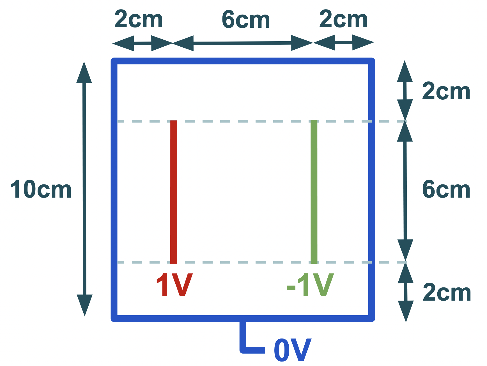

# Documentación para el proyecto final de física computacional

En esta página se resume la documentación y funcionamiento de las implementaciones de diversos métodos numéricos para la simulación del potencial en un capacitar de placas paralelas.

  
  

##Indice de contenidos:

###Tutorial:
 Implementación y funcionamiento de los métodos utilizados. 

###Documentación:
 Referencias de las funciones utilizadas en las distintas implementaciones.